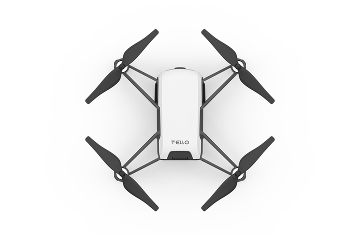

# Fyp_drone_gesture_control
&nbsp;
&nbsp;

## introduction
This project utilizes Mediapipe to implement gesture detection and facial recognition for controlling a drone.

## View the documentation:
[Documentation Link](Report/21028468D_FinalReport.pdf)
## View the Demonstration:
[Demo](https://youtu.be/Fm7Iy0jdM8E)

## Drone model: 
 

## Control Menu :
Keyboard Control Menu:  
“Q”	Quit the program  
“E”	Take off the drone  
“G”	Switch to gesture control mode  
“F”	Switch to face tracking mode  

There are 13 kinds of gestures, and different instructions will be sent according to different gestures, the same set of gestures will be different depending on the left or right hand.  
You can watch all gestures at the end of the document.
